# Manual de usuario — Panel de administración
## Plataforma Web ASOBARES Capítulo Quindío

**Versión:** 1.2 · **Fecha:** 19 de agosto de 2026
**Dirigido a:** dirección ejecutiva, secretaría y practicantes del capítulo
**No necesita conocimientos técnicos.** Si sabe usar el correo, sabe usar esto.

> 📸 **Las once imágenes de este manual son capturas del panel real**, tomadas el 18 de agosto de 2026 sobre la base de datos de demostración, en tema claro y a 1440 px de ancho. Ninguna contiene datos personales de una persona real: todos los establecimientos y nombres que aparecen son ficticios.

---

## 1. Antes de empezar

### Cómo entrar

1. Abra `​/admin` en el navegador.
2. Escriba su correo y su contraseña.
3. El sistema le pedirá un **código de seis dígitos** que llega a su correo. Escríbalo.

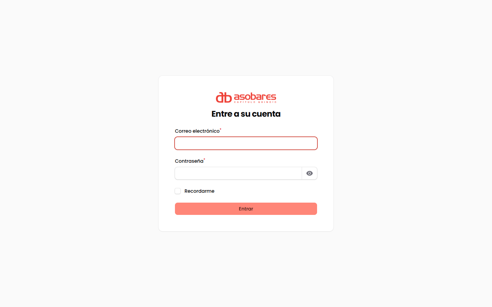

*Pantalla de acceso al panel.*

**El código por correo no es opcional.** Es una exigencia de seguridad del proyecto: protege los datos personales de los asociados, de los candidatos a empleo y de quienes escriben al gremio. Si nunca ha configurado el segundo factor, el sistema lo guía la primera vez en lugar de dejarlo por fuera.

> **Si no le llega el código:** revise correo no deseado. Si sigue sin llegar, avise a quien administre la plataforma — puede ser que el servicio de correo no esté configurado en ese servidor, y hay otra forma de obtenerlo.

### Los dos tipos de cuenta

| | **Dirección** (súper administrador) | **Secretaría** (subadministrador) |
|---|---|---|
| Ver todo el panel | Sí | Sí, salvo Cartera, Transacciones y Usuarios |
| Redactar contenido | Sí | Sí |
| **Publicar al sitio** | **Sí** | **No — queda pendiente de aprobación** |
| Aprobar lo que redactó otra persona | Sí | Solo en las Bolsas |
| Cambiar la configuración del sitio | Sí | No |

Esta separación es deliberada y es uno de los requisitos centrales del proyecto: **la secretaría redacta, la dirección publica.** No es una restricción del formulario que se pueda saltar — vive en el corazón del sistema. Si la secretaría marca «Publicado» y guarda, el registro queda igualmente en «Pendiente de aprobación».

### Cómo está organizado el menú

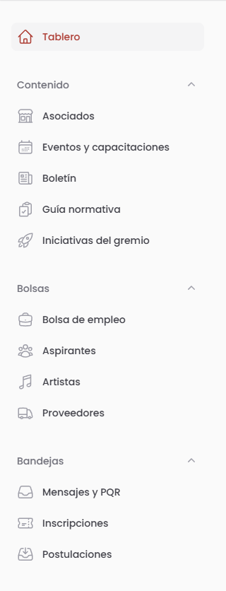

*Menú lateral completo, con la sesión de la Dirección.*

| Grupo | Qué contiene | Para qué |
|---|---|---|
| **Contenido** | Asociados · Eventos · Noticias · Iniciativas · Requisitos de apertura | Lo que se ve en el sitio público |
| **Gremio** | Aliados · Beneficios · Cartera · Transacciones | Afiliación, convenios y dinero |
| **Bolsas** | Vacantes · Artistas · Proveedores · Banco de talento | Lo que publican terceros y usted modera |
| **Bandejas** | Inscripciones · Mensajes y PQR · Postulaciones | Lo que llega de afuera y hay que atender |
| **Configuración** | Municipios · Categorías · Usuarios · Ajustes del sitio · Bitácora | Los cimientos, se tocan poco |

**Regla práctica:** si se pregunta «¿dónde está tal cosa?», piense en si es algo que **usted publica** (Contenido), algo que **le llega** (Bandejas) o algo que **otro publicó y usted revisa** (Bolsas).

---

## 2. Publicar un asociado nuevo

Es la tarea más frecuente: el gremio crece mes a mes.

1. **Contenido → Asociados → Crear**.
2. Llene el nombre, el municipio y la categoría (bar, gastrobar, café, discoteca).
3. Suba la foto de portada. **No se preocupe por el tamaño ni el formato:** el sistema convierte y optimiza las imágenes solo.
4. Distinga los dos bloques de contacto:
   - **Contacto público** — sale en la ficha que ve todo el mundo.
   - **Contacto interno** — solo lo ve el equipo del gremio. Nunca aparece en el sitio.
5. En «Publicación», escoja el estado y guarde.

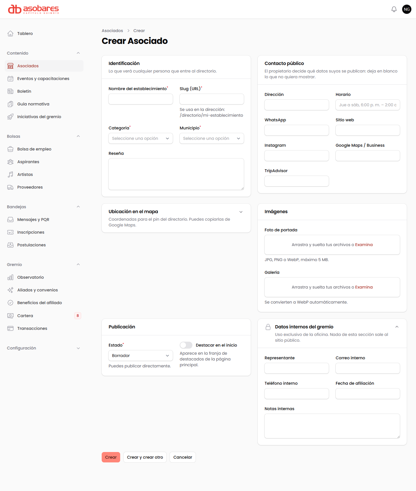

*Formulario de asociado: arriba lo que ve el público, abajo los datos internos del gremio.*

> ⚠️ **El propietario decide qué se publica, no el gremio.** Es un acuerdo con la directiva y una obligación legal: antes de publicar datos de un establecimiento hay que tener su autorización. El bloque «contacto interno» existe justamente para guardar lo que el dueño no autorizó mostrar.

**Si usted es secretaría:** al guardar, el registro queda en «Pendiente de aprobación» y la dirección recibe un aviso. Es lo esperado, no un error.

---

## 3. Publicar un evento y recibir inscripciones

1. **Contenido → Eventos → Crear**.
2. Fecha, hora, lugar, descripción.
3. **Aforo:** si escribe un número, el sistema cierra las inscripciones al llenarse y avisa a quien llegue tarde. Si lo deja vacío, no hay límite.
4. **Valor:** si el evento tiene costo, quien se inscriba pasa por la pasarela de pago. Si es gratuito, se inscribe directo.

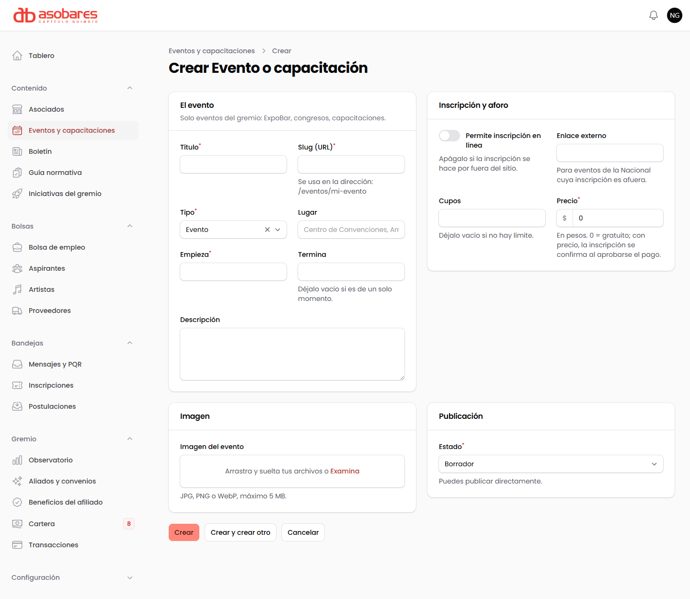

*Formulario de evento, con el bloque de inscripción, cupos y precio.*

Las inscripciones llegan a **Bandejas → Inscripciones**, con el estado de pago de cada una.

> **Solo eventos del gremio.** Es una regla editorial acordada con la directiva: ExpoBar, congresos, capacitaciones propias. Los eventos de bares individuales no se publican, y lo nacional se enlaza al registro de la Nacional.

---

## 4. Mantener la guía normativa

Es el módulo más valioso del sitio: **ningún otro gremio del país lo tiene**, y es la razón principal por la que alguien va a visitar la página. También es el que más se desactualiza si nadie lo cuida.

1. **Contenido → Requisitos de apertura**.
2. Cada trámite pertenece a un municipio y lleva: entidad responsable, pasos, costo aproximado y el formato descargable.
3. Suba el formato oficial como archivo adjunto.

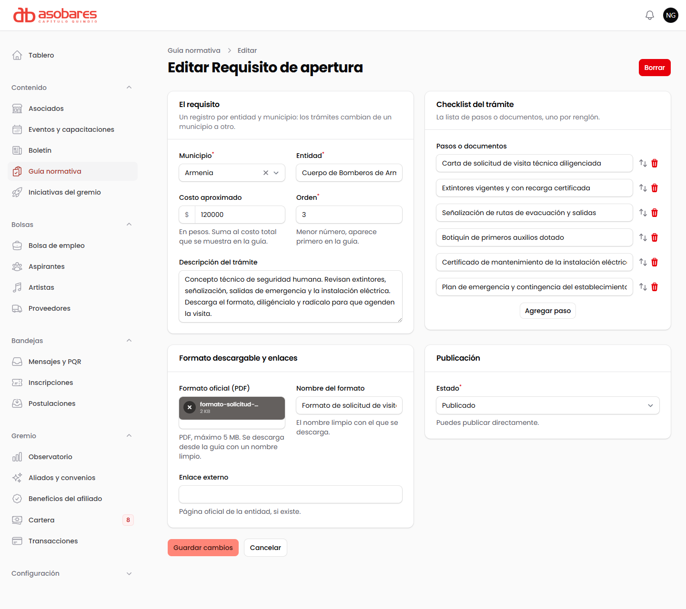

*Ficha de un trámite de la guía normativa con su formato descargable.*

**Al reemplazar un formato viejo por uno nuevo, los enlaces que ya circulan siguen funcionando.** Cámbielo con confianza.

### Cómo saber si la guía sirve

**Observatorio → Consultas de la guía** muestra cuántas personas consultaron cada municipio y cuántos formatos se descargaron.

Ese registro **no guarda ningún dato de quién consultó** — es un conteo anónimo. Sirve para dos cosas: saber qué municipio priorizar, y tener una cifra concreta que mostrarle a una alcaldía cuando el gremio negocie con ella.

---

## 5. Aprobar lo que redactó otra persona

*(Solo dirección.)*

Cuando la secretaría redacta algo, usted recibe un aviso en la **campana** de arriba a la derecha.

1. Pulse la campana → **Revisar**.
2. O entre al **Escritorio**: la primera banda muestra todo lo pendiente, ordenado, con lo más viejo marcado como urgente.
3. En la fila del registro, use **«Aprobar y publicar»** o **«Devolver a borrador»**.

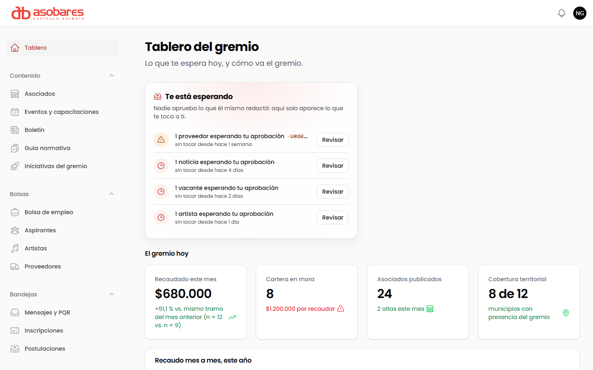

*Tablero: la banda «Te está esperando» solo muestra lo que le toca aprobar a quien entró.*
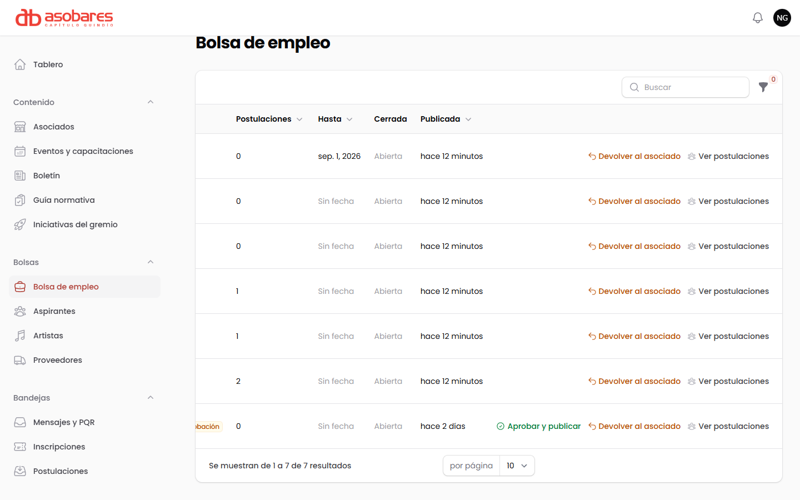

*Solo la fila pendiente ofrece «Aprobar y publicar»; las ya publicadas solo se pueden devolver.*

Si devuelve algo, **el motivo es obligatorio**. No es burocracia: quien lo redactó recibe ese motivo y puede corregir sin adivinar.

---

## 6. Moderar las bolsas

Las vacantes, los artistas y los proveedores **no los crea el gremio**: los publica quien tiene la necesidad, y ustedes aprueban o devuelven.

- **Bolsas → Vacantes.** Las publica el asociado desde su portal. Usted aprueba o devuelve con motivo. Puede aprobar varias a la vez seleccionándolas.
- **Bolsas → Artistas** y **→ Proveedores.** Entran por un formulario público. Al aprobar, el sistema avisa por correo a quien se inscribió.
- **Bandejas → Postulaciones.** Los candidatos a las vacantes. Aquí solo se consultan: **quien gestiona los candidatos es el establecimiento dueño de la vacante**, no el gremio.

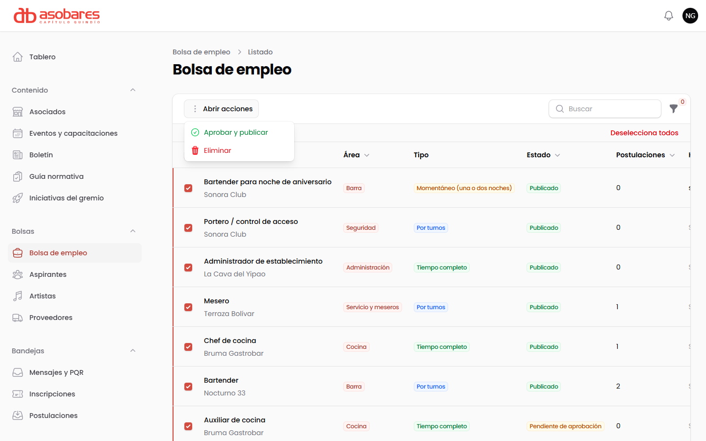

*Aprobación en lote: seleccione las vacantes y abra las acciones.*

> **Ni la secretaría ni la dirección editan la vacante de un establecimiento.** Aprobarla o devolverla, sí. Cambiarle el texto, no. El contenido es del asociado.

> 🔒 **Los datos personales de las bolsas se borran solos.** Las postulaciones y los perfiles del banco de talento se eliminan automáticamente al vencer el plazo de conservación. Es una obligación de la Ley 1581 de 2012 y el sistema la cumple sin que nadie tenga que acordarse. Cada borrado queda anotado en la Bitácora.

---

## 7. Atender mensajes y PQR

**Bandejas → Mensajes y PQR** reúne todo lo que llega por el sitio: contacto general, solicitudes de afiliación, postulaciones de aliados y PQR.

Las **PQR reciben un radicado automático** con formato `PQR-2026-0001`, consecutivo y sin saltos, y el remitente recibe acuse por correo. Eso importa porque las PQR tienen plazos legales de respuesta y el radicado es la prueba de la fecha.

Al responder, use **«Marcar respondido»**: pide una nota que queda como constancia de qué se contestó y cuándo.

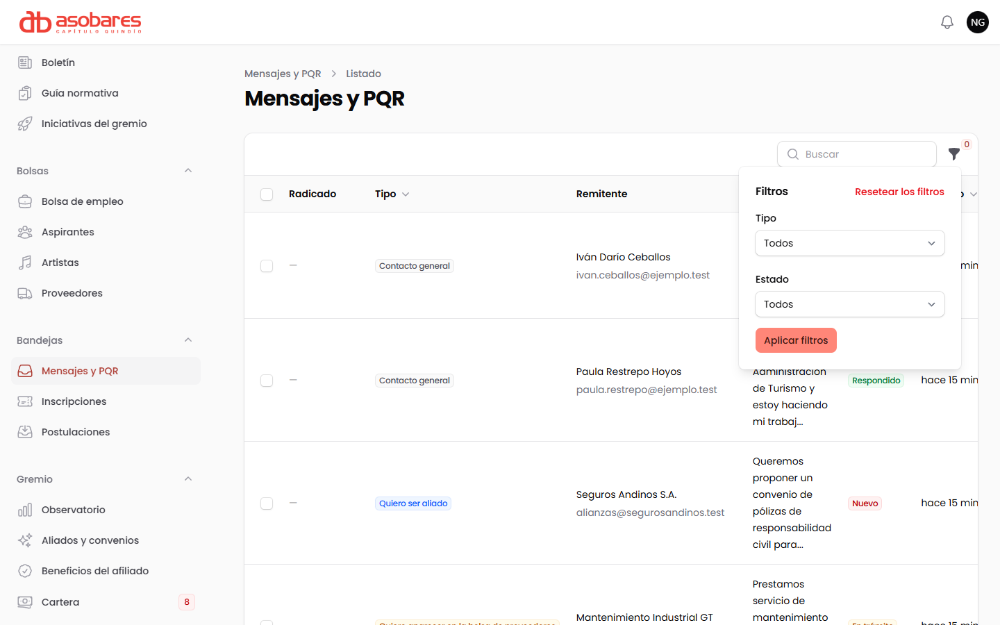

*Bandeja de mensajes con el panel de filtros abierto.*

---

## 8. Cartera y pagos

*(Solo dirección.)*

### Subir el estado de cuenta del mes

1. **Gremio → Cartera → «Descargar plantilla»**. Baja un archivo con el estado actual y las columnas exactas.
2. Pásele el archivo a la contadora, o llénelo usted.
3. **«Importar CSV de la contadora»** → suba el archivo → confirme.
4. Sale un resumen de cuántos estados se actualizaron. **Si una fila viene mal, el sistema dice cuál y por qué, y las demás sí entran.** Un error no daña toda la carga.

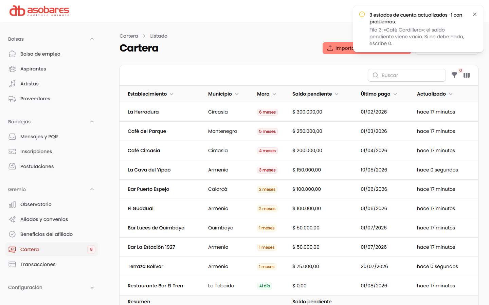

*La importación aplica las filas correctas y explica, una por una, las que rechazó.*

El importador tolera lo que llega en la vida real: encabezados con tildes y mayúsculas, montos como `$1.250.000`, fechas en cualquiera de los dos formatos comunes.

Cargada la cartera, el asociado entra a `/mi-cuenta`, ve **«Debes 3 meses · $150.000»** y paga ahí mismo. Ese era el objetivo declarado por la directiva: *«la gente no paga porque no sabe cuánto debe, entonces todo el mundo llama a Natalia»*.

### Consultar los pagos

**Gremio → Transacciones**, en solo lectura: referencia, fecha, valor y estado. No se editan a mano a propósito — un pago es un hecho, no un dato editable.

---

## 9. Configuración

*(Solo dirección. Se toca poco.)*

- **Ajustes del sitio** — datos de contacto, redes sociales y textos que aparecen en todo el sitio. Cambiarlos aquí los cambia en todas partes. **Nada del sitio está escrito a fuego en el código:** ese fue un requisito explícito del cronograma.
- **Usuarios** — dar de alta a quien entra al panel y con qué rol. Las contraseñas deben ser robustas; el sistema rechaza las débiles.
- **Municipios y Categorías** — las listas de las que se alimentan los formularios.
- **Bitácora** — quién hizo qué y cuándo. Consúltela cuando algo cambió y no sepa quién lo cambió. Con practicantes que rotan, es su red de seguridad.

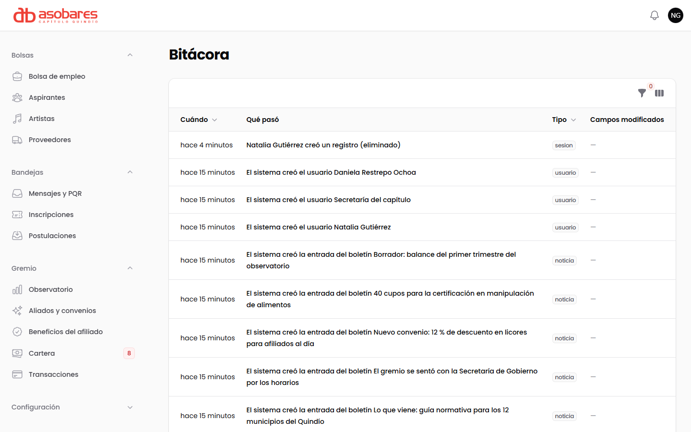

*Bitácora: quién hizo qué y cuándo.*

---

## 10. Preguntas frecuentes

**Publiqué algo y no aparece en el sitio.**
Si usted es secretaría, quedó pendiente de aprobación: avise a la dirección. Si es dirección, revise que el estado sea «Publicado» y no «Borrador».

**Me equivoqué al publicar.**
Cambie el estado a «Borrador» y guarde. Sale del sitio de inmediato.

**Se me perdió un mensaje.**
No se pierde: todo lo que entra por el sitio queda en Bandejas. Use los filtros por tipo y por fecha. Tenga en cuenta que los mensajes muy antiguos ya respondidos se eliminan solos por la política de datos.

**¿Puedo borrar un asociado?**
Puede, pero **casi siempre es mejor despublicarlo**: pasarlo a «Borrador» lo saca del sitio y conserva su historial de pagos. Borrarlo se lleva por delante lo asociado a él.

**¿Cómo cambio el tema claro/oscuro?**
Arriba a la derecha. Su elección se recuerda y vale también para el sitio público.

---

## 11. Qué falta para dar este manual por terminado

**Contenido, capturas y PDF: completos** (19 de agosto de 2026). Las once imágenes se tomaron del panel real con la base de demostración cargada. Queda:

1. ✅ ~~Exportar a PDF~~ — hecho. `Manual de usuario - Panel ASOBARES Quindio.pdf`, 24 páginas, en esta misma carpeta. Se regenera con `node docs/ingenieria/herramientas/manual-a-pdf.mjs`; **edite siempre este `.md`, nunca el PDF.**
2. **Complementar con vídeo** si se prefiere: un recorrido de 10 minutos que siga las secciones 2, 3, 5 y 8 cubre el 90 % del uso diario.
3. **Verificar contra la realidad de la capacitación:** el criterio contractual no es que el manual exista, sino que **al terminar la sesión el personal publique un asociado, un evento y una noticia sin ayuda**. Lo que falle en esa prueba es lo que hay que reescribir aquí. Mientras esa sesión no ocurra, este manual está probado contra el software pero no contra sus lectores. El formato para dejar constancia de esa sesión es `constancias/Acta 02 - Constancia de capacitacion.pdf`.

> ⚠️ **Si el panel cambia, estas capturas mienten.** Son fotografías de una versión concreta (`main` en `4f15d24`). Cualquier cambio de interfaz obliga a repetir la que corresponda; una captura vieja en un manual es peor que ninguna, porque el lector busca en pantalla algo que ya no está.
>
> El trabajo de interfaz del 19 de agosto **no las invalida**: toca `resources/css/app.css` y las vistas de `resources/views/publico/`, y ninguna de las dos cosas se carga en `/admin`. Lo único que cambió del panel es el fichero del logotipo, y son los mismos píxeles.

---

*Elaborado como entregable de la Fase 4 del cronograma firmado por la dirección ejecutiva de ASOBARES Capítulo Quindío.*
